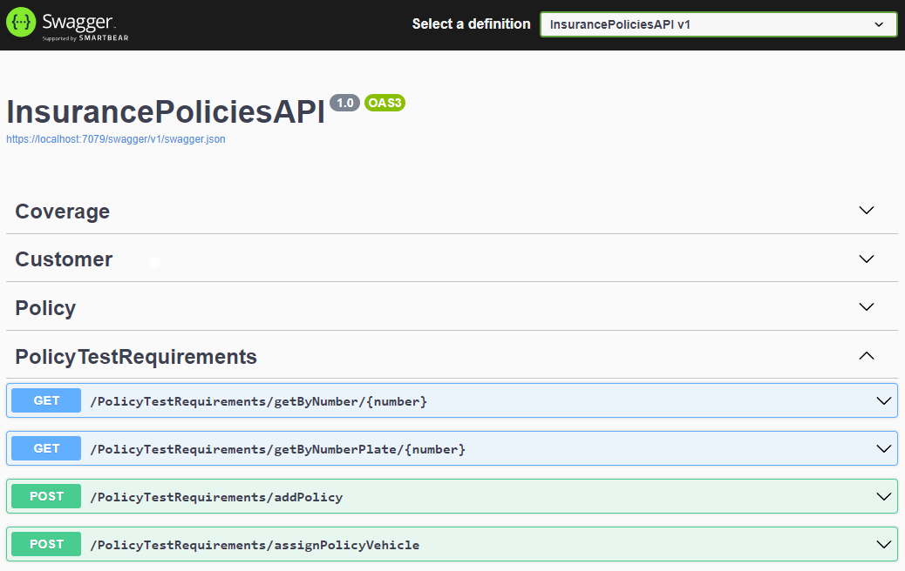

# API para el manejo de pólizas

La API que presentamos permite realizar operaciones CRUD (Crear, Leer, Actualizar y Eliminar) sobre el manejo de pólizas, clientes, vehículos y coberturas. Es el resultado de un aprendizaje rápido y de investigación intensiva sobre el desarrollo con .NET y la manipulación de bases de datos a través de un ORM.

En un periodo de 1-2 días, logre diseñar y desarrollar esta API, gracias a mi conocimiento previo sobre bases de datos relacionales y Programación Orientada a Objetos con Java. A lo largo del proceso, me enfoque en aprender los conceptos y tecnologías específicas de .NET, como lo es sus características, estructura y el manejo con el ORM **EntityFramework**.

## Pasos para inicializarel proyecto
- Cambiar la cadena de conexión a la BD **"InsurancePoliciesContext"** en **appsettings.json**
- Instalar la herramienta de EF con: **dotnet tool install --global dotnet-ef**
- Instalar los packages con: **dotnet restore**
- Iniciar la migración con : **dotnet ef database update**
## Comandos utilizados para crear el proyecto
- dotnet tool install --global dotnet-ef
- dotnet new webapi -f net6.0
- dotnet add package Microsoft.EntityFrameworkCore.SqlServer
- dotnet add package Microsoft.EntityFrameworkCore.Design 
- dotnet ef migrations add InitialCreate 
- dotnet ef migrations add SeedDataDefault y agregar datos predeterminados
- dotnet ef database update
## Endpoints para los requisitos de la prueba

### `GET /PolicyTestRequirements/getByNumber/{number}`

Devuelve una póliza por el número almacenado.

### `GET /PolicyTestRequirements/getByNumberPlate/{number}`

Devuelve una póliza por el número de placa de un vehículo.
### `POST /PolicyTestRequirements/addPolicy`

Crea una una nueva póliza con validando que la fecha de caducidad sea valida.

### `POST /PolicyTestRequirements/assignPolicyVehicle`

Asigna una póliza existente a un vehículo validando que la póliza se encuentre vigente.

## Requisitos de la prueba

Los requisitos de la prueba se encuentran en la sección "PolicyTestRequirements" de Swagger. Para acceder a Swagger, navega a la URL de la API y agrega "/swagger" al final. Por ejemplo "https://localhosto.com/7079//swagger".

Una vez en Swagger, busca la sección "PolicyTestRequirements" en la barra lateral izquierda y haz clic en ella para expandirla. Ahí encontrarás los requisitos de la prueba detallados.

